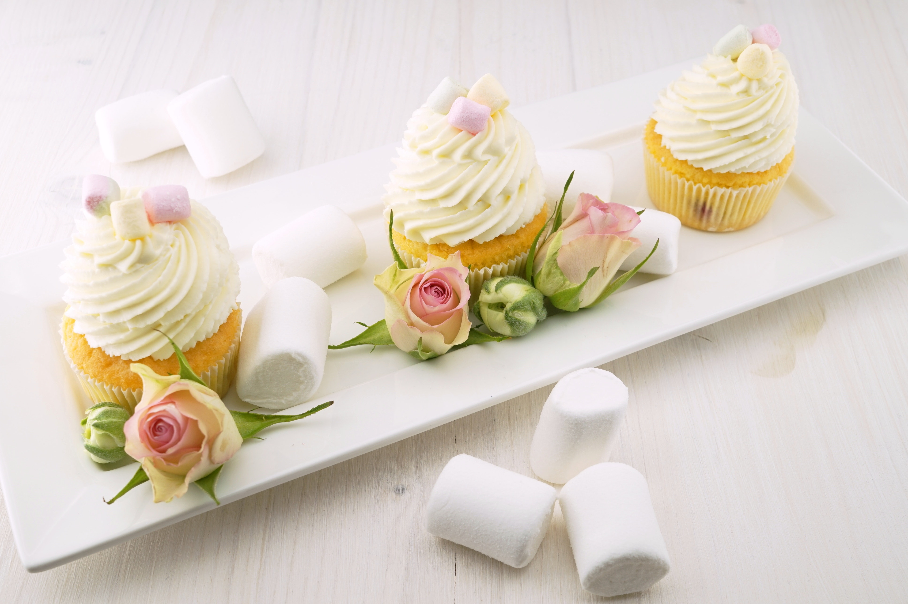
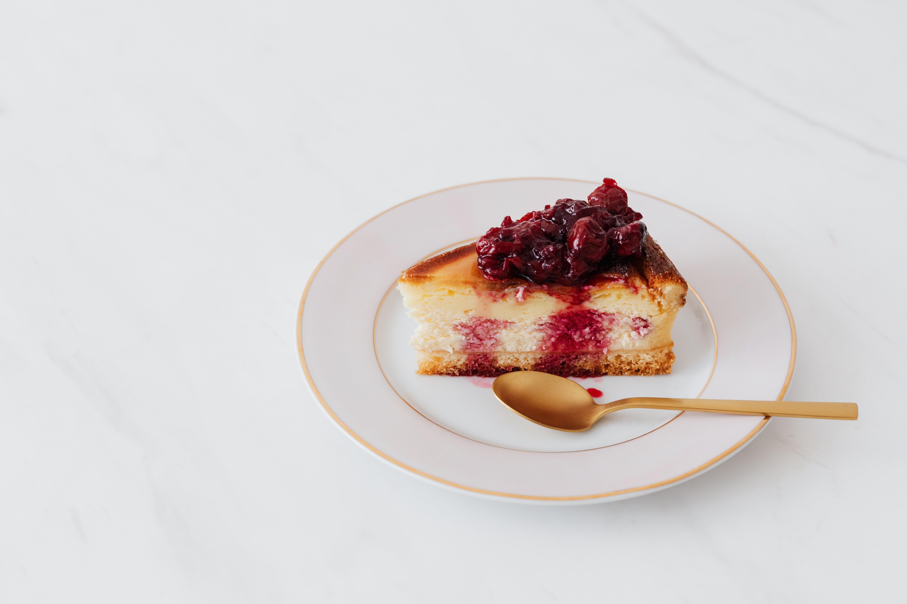

# IT2A-Repo
<!doctype html>
<html lang="en">
  <head>

    <meta charset="utf-8">
    <meta http-equiv= "X-UA-Compatible" content="IE=edge">
    <meta name="viewport" content="width=device-width, initial-scale=1">
    <title>Oh so sweet | Order your favorite sweet treats at Oh so sweet shop</title>
    <link href="https://cdn.jsdelivr.net/npm/bootstrap@5.3.0-alpha1/dist/css/bootstrap.min.css" rel="stylesheet">
    <link rel="stylesheet" type="text/css" href="style.css">

  </head>
  <body>

    
    
    

    <nav class="navbar navbar-expand-lg navbar-light bg-light fixed-top">
      

          <a href="#" class="navbar-brand">
              
              oh so sweet
          </a>
          <ul class="nav justify-content-center">
          <button type="button" class="navbar-toggler" data-bs-toggle="collapse" data-bs-target="#navbarCollapse">
              
          </button>
        
          

              

                  <a href="#" class="nav-item nav-link active">Home</a>
                  <li class="nav-item dropdown">
                    <a class="nav-link dropdown-toggle" href="#" role="button" data-bs-toggle="dropdown" aria-expanded="false">
                      Menu
                    </a>
                    <ul class="dropdown-menu">
                      <li><a class="dropdown-item" href="#">Best-sellers</a></li>
                      <li><a class="dropdown-item" href="#">Cakes</a></li>
                      <li><a class="dropdown-item" href="#">Beverages</a></li>
                      <li><a class="dropdown-item" href="#">Other desserts</a></li>
                      <li>
</li>
                      <li><a class="dropdown-item" href="#">Find More</a></li>
                    </ul>
                  </li>
                  <a href="#" class="nav-item nav-link active">About Us</a>
                  <a href="#" class="nav-item nav-link">Our Story</a>
                  <a href="#" class="nav-item nav-link active">Services</a>
                  <a href="#" class="nav-item nav-link active">Order Now</a>
                  
                  
              

         </ul>   
          

      

  

    

      <button type="button" data-bs-target="#carouselExampleCaptions" data-bs-slide-to="0" class="active" aria-current="true" aria-label="Slide 1"></button>
      <button type="button" data-bs-target="#carouselExampleCaptions" data-bs-slide-to="1" aria-label="Slide 2"></button>
      <button type="button" data-bs-target="#carouselExampleCaptions" data-bs-slide-to="2" aria-label="Slide 3"></button>
      <button type="button" data-bs-target="#carouselExampleCaptions" data-bs-slide-to="4" aria-label="Slide 4"></button>
    

    

      

        
        

          <h5 font size="250" style="color:black;" >NEW SWEET TREATS</h5>
          
Get yourselves sweet and delicious cupcakes! Check out other sweet treats in our shop.

        

      

      

        
        

          <h5 sfont size="250" style="color:black;" >Enjoy your treats with our beverages.</h5>
          
          
Iced coffee, milktea, frappes, hot choco, black coffee, milkshake--name it because we have that in our sweet house.

        

      

      

        
        

          <h5 font size="250" style="color:black;">Aesthetic and instagrammable sweet shop</h5>
          
Customers could visit our shop located at Muntinlupa. Visit now with your friends and loved ones!

        

      

      

         
        

          <h5 font size="250" style="color:black;"> SHARING IS CARING!</h5>
          
We are open for feedback and more suggestions from our dearest customers to further improve our oh so sweet shop.

        

      

    

    <button class="carousel-control-prev" type="button" data-bs-target="#carouselExampleCaptions" data-bs-slide="prev">
      
      Previous
    </button>
    <button class="carousel-control-next" type="button" data-bs-target="#carouselExampleCaptions" data-bs-slide="next">
      
      Next
    </button>

    

  

  <section id="about" class="about-section-padding">
    

      

        

          

            

          

        

        
  
          <h2 style="color:rgb(109, 86, 57);">Hello Sweeties! </h2>  
          
Welcome to Oh so sweet online shop! Our shop sells different kinds of baked goods and sweet treats as well as mouth-watery beverages.   We provide sweet treats to satisfy people cravings as we believe that everyone deserve a special treat. For our dear customers who would like to visit our actual store, it is located at Alabang, Muntinlupa. However we also provide this website and social media to communicate with our potential customers.   We accept online order, transaction and have the best quality service in terms of delivering it to your doorsteps. Check out our delicious treats and order now! 
  

          <h3 style="color:rgb(109, 86, 57);"> Our Treats </h3>  
          
Our shop sells different kinds of baked goods and sweet treats as well as mouth-watery beverages.   We provide sweet treats to satisfy people cravings as we believe that everyone deserve a special treat. For our dear customers who would like to visit our actual store, it is located at Alabang, Muntinlupa. However we also provide this website and social media to communicate with our potential customers.   We accept online order, transaction and have the best quality service in terms of delivering it to your doorsteps. Check out our delicious treats and order now! 
  
          
        

        

          <h2 style="color:rgb(109, 86, 57);">Our Bittersweet Story </h2>  
          
 We provide sweet treats to satisfy people cravings as we believe that everyone deserve a special treat. For our dear customers who would like to visit our actual store, it is located at Alabang, Muntinlupa. However we also provide this website and social media to communicate with our potential customers.We accept online order, transaction and have the best quality service in terms of delivering it to your doorsteps.  
  

        

      

    

  </section>

  

    

      

        
        

         
          
Come and visit our actual store located at Alabang, Muntinlupa. Visit us with your friends, families and your special one. You can also treat yourself with something sweet because you deserve it.

        

      

      <a href="#" class="btn btn-success"> Order Now</a>  
    

    

      

        
        

         
          
We have a lot of baked goods, sweet treats and different kinds of beverages in our menu. Oh so sweet also offers some combo and bundle treats and orders.

        

      

    

    

      

        
        

         
          
Oh so sweet has a good quality of service and delivery. There might be additional expenses depending on the location of the customer but nevertheless, the quality and flavorful of our sweet goods will still the same even after delivering.

        

      

    

    
      

    

  

  

    

      

        

          
           
        <h5 class="card-title" >Satisfy now your cravings!
           </h5> 
          
Get yourselves sweet and delicious cupcakes! Check out other sweet treats in our shop and order now.

          <a href="#" class="btn btn-success">Order Now</a>
        

      

    

    

      

        

          <h5 class="card-title">Give us your feedback!
             </h5>
          
We are open for feedback and more suggestions from our dearest customers to further improve our oh so sweet shop.

          <a href="#" class="btn btn-success">Comment</a>
        

      

    

  

  

  
  </body>
</html>
